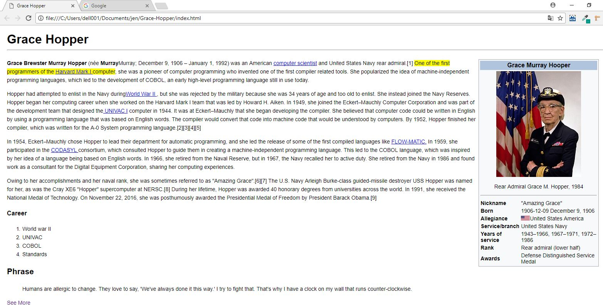

# Replicando la página de Grace Hopper usando React 
## Desarrollo 
Para su desarrollo hicimos uso de la libreria react y componentes en JSX, en este repositorio encontramos 3 componentes (Header,Aside y Main) los cuales son importados desde App.js

* Creditos: Jennifer Carmen
